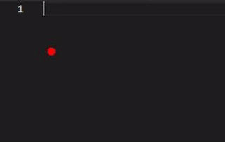

# PSSCREENRECORDER


> Desktop Video Capture with PowerShell

[releasebadge]: https://img.shields.io/static/v1.svg?label=version&message=1.0.6&color=blue
[datebadge]: https://img.shields.io/static/v1.svg?label=Date&message=2019-03-15&color=yellow
[psbadge]: https://img.shields.io/static/v1.svg?label=PowerShell&message=5.0.0&color=5391FE&logo=powershell
[btbadge]: https://img.shields.io/static/v1.svg?label=bartender&message=6.1.22&color=0B2047


| Language | Release Version | Release Date | Bartender Version |
|:-------------------:|:-------------------:|:-------------------:|:-------------------:|
|![psbadge]|![releasebadge]|![datebadge]|![btbadge]|


Authors: Adrian.Andersson

Company: Adrian Andersson

Latest Release Notes: [here](./documentation/1.0.6/release.md)

***

<!--Bartender Dynamic Header -- Code Below Here -->


***
##  Getting Started

### Installation
How to install:
```powershell
install-module psScreenRecorder

```

---

### Configuration
Grab ffmpeg:
```powershell
install-ffmpeg psScreenRecorder

```

### Create a video

```powershell
new-psScreenRecord

```

### Convert it to a GIF

```powershell
convert-mp4togif -mp4Path my.mp4 -gifPath my.gif

```


***
## What Is It

Capture a video of your screen using PowerShell

### Example:



***
## Acknowledgements
Kyle Schwarz for the gift that is FFMPEG
https://ffmpeg.zeranoe.com

Peter Hinchley for his Scaling Rate type definition
https://hinchley.net/articles/get-the-scaling-rate-of-a-display-using-powershell/


<!--Bartender Link, please leave this here if you make use of this module -->
***

## Build With Bartender
> [A PowerShell Module Framework](https://github.com/DomainGroupOSS/bartender)

